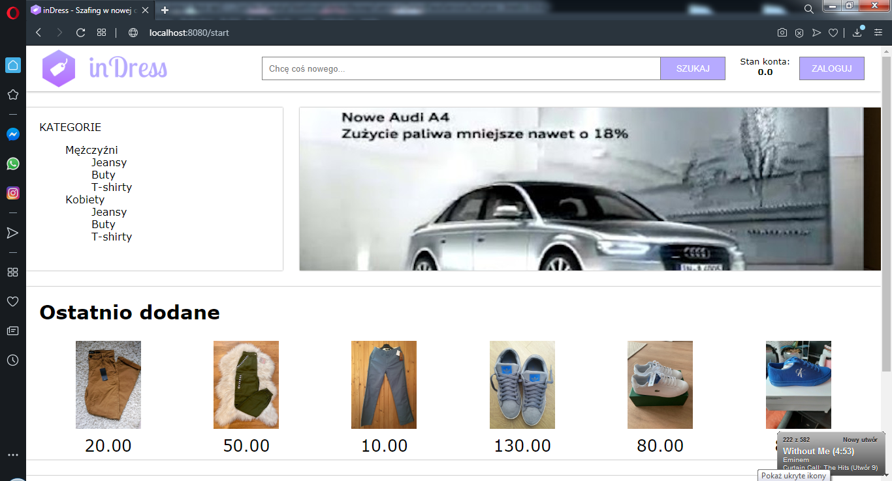

# Indress
## Wstęp
Jest to jeden z kolejnych projektów non-profit stworzonych, aby szlifować swoje umiejętności.

## 1. Table of contents
* [Informacje generalne](#2-general-info)
* [Technologie](#3-technologies)

## 2. Informacje generalne
Indress App!

Aplikacja internetowa w formie sklepu z odzieżą, znajdziemy tu jeansy, buty i t-shirty zarówno dla mężczyzn jak i kobiet.
Ze względu na ograniczenia zdjęcia przedmiotów (jak i wszystkie inne) są przechowywane w katalogu aplikacji pod adresem
resources/static/img. Na każdym end-poicie jeżeli widzisz logo w headerze odsyła ono do strony głównej.

* /start

Po lewej stronie znajdziemy kontener z kategoriami dostępnymi dla nas, każdy z nich odsyła nas do podanej kategorii.
Jeżeli nie będziesz zautoryzowany aplikacja odeśle Cię do end-pointu z autoryzacją.

Dzięki wykorzystaniu schedulerów reklamy są losowo zmieniane co 10 sekund.

* /login

Po kliknięciu w przycisk "ZALOGUJ" na stronie głównej aplikacja przeniesie nas na stronę autoryzacji, w przypadku
uzyskania autoryzacji zostaniemy przekierowani na stronę wyszukiwania, gdzie w prawym górnym rogu znajdziesz aktualny
nasz stan konta i przycisk z możliwościa wylogowania się. Każde nowe konto na start otrzymuje bonus w wysokości 1000zł.
W przypadku braku konta użyj "ZAREJESTRUJ SIĘ".

* /singup

Ta podstrona pozwala nam zarejestrować się do aplikacji. Pod każdym polem tekstowym znajduje się ograniczenie, w przypadku
nie stosowania się do ograniczeń nie zostaniemy zarejestrowani. Po pomyślnym zarejestrowaniu zostaniemy odesłani do
strony z autoryzacją.

* /search

Po udanej autoryzacji możemy przeglądać przedmioty dostępne do zakupu umieszczone w zdalnej bazie danych remotemysql.com.
Dzięki stworzonemu filtrowi możemy znaleźć jedynie przedmioty, które nas interesują. Każda kafelka z przedmiotem odsyła
nas do osobnej podstrony w pełni go prezentującej.

Tutaj również reklamy zmieniają się cyklicznie co 10 sekund. Możemy to zauważyć odświeżając stronę.

End-point posiada 3 parametry, które nie są wymagane itemName, mainCategory, clothes. W przypadku ich braku zostanie nam
wyświetlona lista wszystkich dostępnych przedmiotów. Analogicznie podając przynajmniej jeden z nich zostanie nam
wyświetlona odpowiednia lista.

* /item

Podstrona dokładnie opisuje wybrany przedmiot, zawiera jego wszystkie informacje tj. tytuł, marka, rozmiar, stan, kolor,
data dodania, opis, cena, zdjęcie oraz główna i podrzędna kategoria.

End-point przyjmuje jeden wymagany parametr id.

Zdecydowałeś się na zakup? Klikamy "KUP TERAZ", w przypadku wachań możemy wrócić do wyszukiwarki klikając w
odpowiedni odsyłacz w postaci "Strona główna / Kategoria główna / Kategoria podrzędna".

* /buy

Gdy już się zdecydujemy zobaczysz podsumowanie zakupu: koszt przedmiotu, wysyłki i aktualny stan konta. Koszt wysyłki
jest stały i wynosi 10zł niezależnie od przedmiotu.

End-point przyjmuje jeden wymagany parametr id.

* /success

Po udanym zakupie aplikacja podziękuje za zakupy i zaprosi do dalszych poszukiwań! :)

* /reconstructDatabase

Ten end-point został dodany przeze mnie ze względu na ograniczenia się jedynie do bazy danych. Po zatwierdzeniu w
wyszukiwarce baza danych zostanie odbudowana. Aplikacja posiada zabezpieczenie przed brakiem przedmiotów, w przypadku
wykupienia ostatniego z nich zostanie automatycznie wykonana metoda odbudowy bazy danych.

Aplikacja jest dosyć okrojona jak na dzisiejsze strony handlowo-usługowe, zdecydowanie będzie ona w przyszłości rozwijana.
Pomimo znajomości React'a zdecydowałem, że wykonam front-end z pomocą Thymeleaf'a ze względu na to, że mam z nim większe
doświadczenie. Pomysły na przyszłość: wykonanie front-endu z pomocą React'a, koszyk, dodawanie przedmiotów, selekcja
"Ulubione przedmioty", wiadomości między użytkownikami oraz wiele innych większych i mniejszych zmian.

Aplikacja została udostępniona na zdalny serwer heroku.com: https://face-detector-ak.herokuapp.com/

## 3. Technologie
Project is created with:
* Java 8
* Spring Boot 2
* Spring Data
* Spring Security
* Java Scheduler
* Thymeleaf
* JUnit 5
* Lombok
* Swagger

